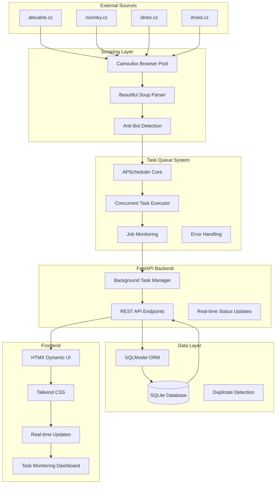
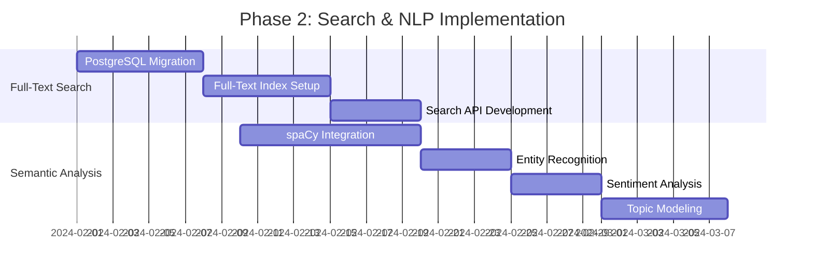
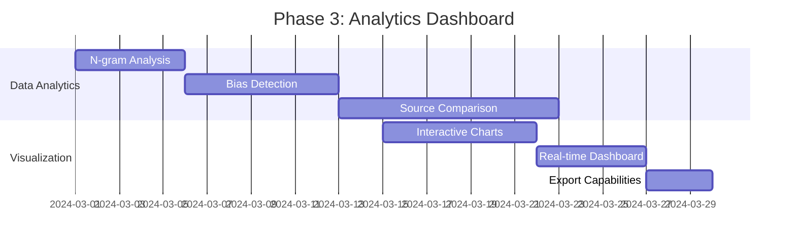

# 🇨🇿 Czech News Scraper & Media Analytics Platform

> **Advanced news aggregation and media analytics platform** for Czech news sources with full-text search, semantic analysis, and comparative media bias insights.

[](https://python.org)
[](https://fastapi.tiangolo.com)
[](https://www.gnu.org/licenses/gpl-3.0)

## Project Vision

Transform how we understand Czech media landscape by providing **data-driven insights** into how different news outlets cover the same stories, revealing **media bias patterns**, **semantic similarities**, and **editorial perspectives** through advanced NLP and analytics.

## Current Features

- **Automated Scraping**: Concurrent scraping from 4 major Czech news sources every 2 hours
- **Modern Web Interface**: HTMX-powered responsive UI with real-time updates
- **Advanced Filtering**: Source-based filtering and search capabilities
- **Task Management**: Quartz-like background job scheduling with monitoring
- **High Performance**: Async FastAPI backend with concurrent task processing
- 🛡**Anti-Bot Protection**: Camoufox with GeoIP bypass for reliable scraping

## System Architecture



## Development Roadmap

### Phase 1: Foundation (COMPLETED ✅)
- [x] Basic scraping infrastructure
- [x] FastAPI backend with async support
- [x] SQLite database with SQLModel
- [x] Task queue system (Quartz-like)
- [x] Web interface with HTMX
- [x] Concurrent scraping capabilities

### Phase 2: Advanced Search & NLP (NEXT)


**Full-Text Search Implementation**
- [ ] **Database Migration**: PostgreSQL with full-text search capabilities
- [ ] **Search Engine**: Advanced text indexing with ranking algorithms
- [ ] **Query Interface**: Natural language search with filters
- [ ] **Search Analytics**: Query performance and user behavior tracking

**Semantic Analysis Engine**
- [ ] **NLP Pipeline**: spaCy + custom Czech language models
- [ ] **Entity Recognition**: People, places, organizations, topics
- [ ] **Sentiment Analysis**: Article tone and emotional content analysis
- [ ] **Topic Modeling**: LDA/BERT-based topic discovery and clustering

### Phase 3: Media Analytics Dashboard


**Advanced Analytics Features**
- [ ] **N-gram Analysis**: Word frequency and phrase pattern analysis
- [ ] **Media Bias Detection**: Algorithmic bias identification using linguistic patterns
- [ ] **Comparative Analysis**: Side-by-side source comparison on same topics
- [ ] **Trend Analysis**: Topic popularity and coverage patterns over time
- [ ] **Semantic Similarity**: How similarly different outlets cover the same story

**Interactive Dashboard**
- [ ] **Real-time Analytics**: Live updating charts and metrics
- [ ] **Bias Visualization**: Media bias spectrum visualization
- [ ] **Topic Networks**: Interactive topic relationship graphs
- [ ] **Export System**: PDF reports and data export capabilities

### Phase 4: Advanced Features
- [ ] **Machine Learning**: Predictive analytics for news trends
- [ ] **API Expansion**: Public API for researchers and developers
- [ ] **Multi-language Support**: Slovak and other regional languages
- [ ] **Mobile App**: React Native companion app
- [ ] **AI Insights**: GPT-powered analysis and summaries

## Technology Stack

### **Backend Architecture**
- **FastAPI**: Modern async Python web framework
- **🗄SQLModel**: Type-safe ORM with Pydantic integration
- **SQLite → PostgreSQL**: Scalable database progression
- **APScheduler**: Enterprise-grade task scheduling
- **Camoufox**: Anti-detection web scraping
- **Beautiful Soup**: HTML parsing and extraction

### **Frontend & UI**
- **HTMX**: Dynamic HTML without JavaScript complexity
- **Tailwind CSS**: Utility-first CSS framework
- **Jinja2**: Server-side templating
- **Chart.js**: Interactive data visualizations (planned)

### **Data Science & NLP**
- **spaCy**: Industrial-strength NLP
- **Transformers**: BERT/GPT models for semantic analysis
- **scikit-learn**: Machine learning algorithms
- **pandas**: Data manipulation and analysis
- **NumPy**: Numerical computing

### **Infrastructure**
- **Python 3.11+**: Modern Python features
- **Rye**: Fast Python package management
- **Docker**: Containerization (planned)
- **Cloud Deploy**: AWS/GCP deployment (planned)

## Quick Start

### Prerequisites
- Python 3.11+
- Rye package manager

### Installation

1. **Clone the repository**
   ```bash
   git clone https://github.com/username/python-news-scraper.git
   cd python-news-scraper
   ```

2. **Setup environment**
   ```bash
   rye sync
   source .venv/bin/activate  # On Windows: .venv\Scripts\activate
   ```

3. **Launch the application**
   ```bash
   fastapi dev src/python_news_scraper/main.py
   ```

4. **Access the interface**
   - Web UI: http://localhost:8000
   - API Docs: http://localhost:8000/docs
   - Health Check: http://localhost:8000/health

## 📖 API Documentation

### **Core Endpoints**

| Method | Endpoint | Description |
|--------|----------|-------------|
| `GET` | `/` | Main web interface |
| `GET` | `/api/articles` | Paginated articles with filtering |
| `POST` | `/scrape` | Manual scraping trigger |
| `GET` | `/api/tasks` | Task queue status |
| `POST` | `/api/tasks/{id}/cancel` | Cancel running task |

### **Task Management API**

```python
# Get all tasks
GET /api/tasks
{
  "tasks": [...],
  "total": 42
}

# Get specific task status
GET /api/tasks/{task_id}
{
  "id": "uuid",
  "status": "running",
  "progress": 0.75,
  "result": {...}
}

# Schedule custom scraping
POST /api/scrape/schedule
{
  "source": "aktualne",
  "schedule_type": "interval", 
  "hours": 1
}
```

## Use Cases & Applications

### **For Researchers & Academics**
- **Media Bias Studies**: Quantitative analysis of editorial perspectives
- **Political Communication**: How political events are covered across outlets
- **Linguistic Research**: Czech language corpus for NLP research

### **For Journalists & Media**
- **Competitive Analysis**: Monitor how competitors cover stories
- **Story Discovery**: Identify trending topics across multiple sources
- **Fact Checking**: Compare different versions of the same story

### **For Businesses & PR**
- **Brand Monitoring**: Track company mentions across news sources
- **Crisis Management**: Monitor news sentiment during incidents
- **Market Intelligence**: Industry news aggregation and analysis

## Configuration

### **Environment Variables**
```bash
# Database Configuration
DATABASE_URL=sqlite:///./news_scraper.db

# Scraping Configuration  
SCRAPE_INTERVAL_HOURS=2
MAX_ARTICLES_PER_SOURCE=50

# Task Queue Configuration
MAX_CONCURRENT_TASKS=10
TASK_TIMEOUT_MINUTES=30
```

### **Advanced Configuration**
```python
# Custom scraping targets
SCRAPING_SOURCES = {
    "aktualne": "https://aktualne.cz",
    "novinky": "https://novinky.cz", 
    "idnes": "https://idnes.cz",
    "ihned": "https://ihned.cz"
}

# NLP Configuration (Phase 2)
NLP_MODEL = "cs_core_news_sm"  # Czech spaCy model
SENTIMENT_THRESHOLD = 0.1
TOPIC_MODEL_COMPONENTS = 10
```

## Contributing

We welcome contributions! Here's how to get started:

1. **Fork** the repository
2. **Create** a feature branch (`git checkout -b feature/amazing-feature`)
3. **Commit** your changes (`git commit -m 'Add amazing feature'`)
4. **Push** to the branch (`git push origin feature/amazing-feature`)
5. **Open** a Pull Request

### **Development Setup**
```bash
# Install development dependencies
rye sync --dev

# Run tests
pytest

# Code formatting
black src/
isort src/

# Type checking
mypy src/
```

## Project Structure

```
python-news-scraper/
├── 📁 src/python_news_scraper/
│   ├── 🐍 main.py                    # FastAPI application entry point
│   ├── 📁 core/                      # Core system components
│   │   ├── 🗄️ database.py           # Database configuration
│   │   ├── 📊 models.py              # SQLModel data models
│   │   ├── ⏰ scheduler.py           # Task scheduling system
│   │   └── 🔄 task_queue.py          # Quartz-like job queue
│   ├── 📁 api/                       # API layer
│   │   ├── 📁 routes/
│   │   │   └── 🛣️ articles.py       # Article API endpoints
│   │   └── 📁 services/
│   │       ├── 🔗 scraping_service.py # Scraping coordination
│   │       └── 📁 scraping/          # Individual scrapers
│   │           ├── 📰 aktualne.py
│   │           ├── 📰 novinky.py
│   │           ├── 📰 idnes.py
│   │           └── 📰 ihned.py
│   └── 📁 templates/                 # Frontend templates
│       ├── 🏠 base.html
│       ├── 📋 index.html
│       ├── 📄 articles_list.html
│       └── ✅ scrape_result.html
├── 📋 pyproject.toml                 # Project configuration
├── 📚 README.md                      # This file
└── 📄 requirements*.lock             # Locked dependencies
```

## License

This project is licensed under the **GNU General Public License v3.0** - see the [LICENSE](LICENSE.txt) file for details.

### **Why GPL v3?**
- **Open Source**: Ensures the project remains open and accessible
- **Community**: Encourages contributions and improvements
- **🛡Protection**: Prevents proprietary forks without contribution back

## Support & Contact

- **Bug Reports**: [GitHub Issues](https://github.com/tadeasf/python-news-scraper/issues)
- **Feature Requests**: [GitHub Discussions](https://github.com/tadeasf/python-news-scraper/discussions)
- **Email**: [business@tadeasfort.com](mailto:business@tadeasfort.com)

---

<div align="center">

**⭐ Star this repository if you find it useful! ⭐**

Made with ❤️ for the Czech tech community

</div>
